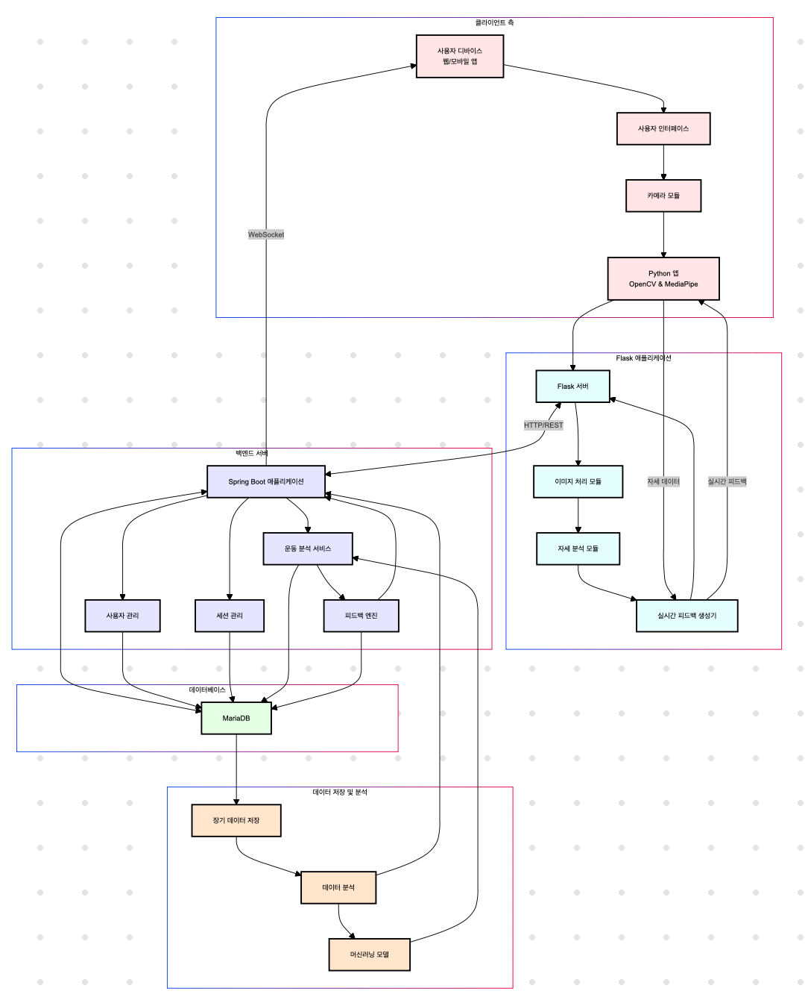
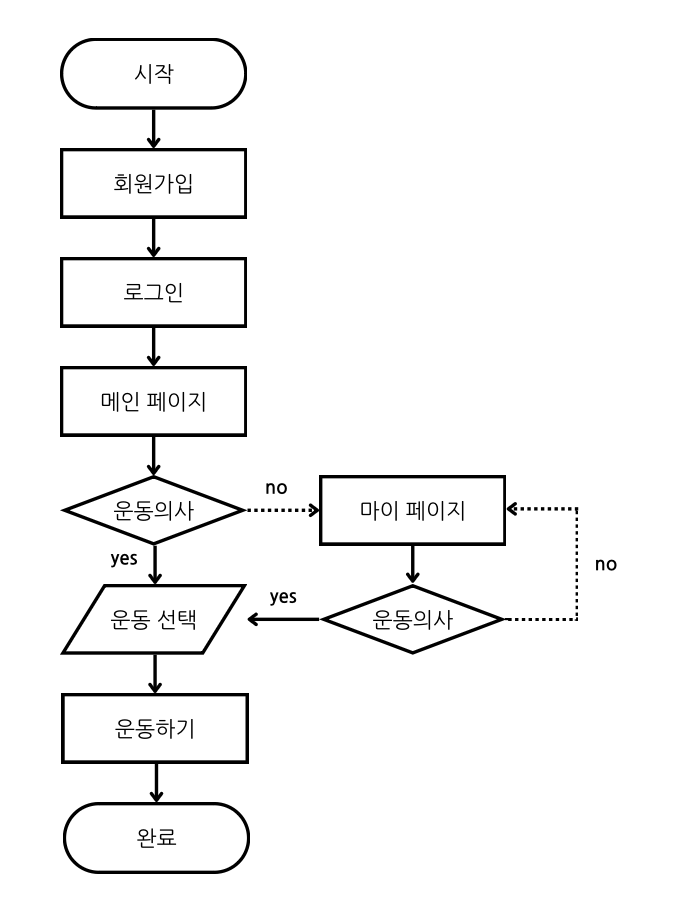
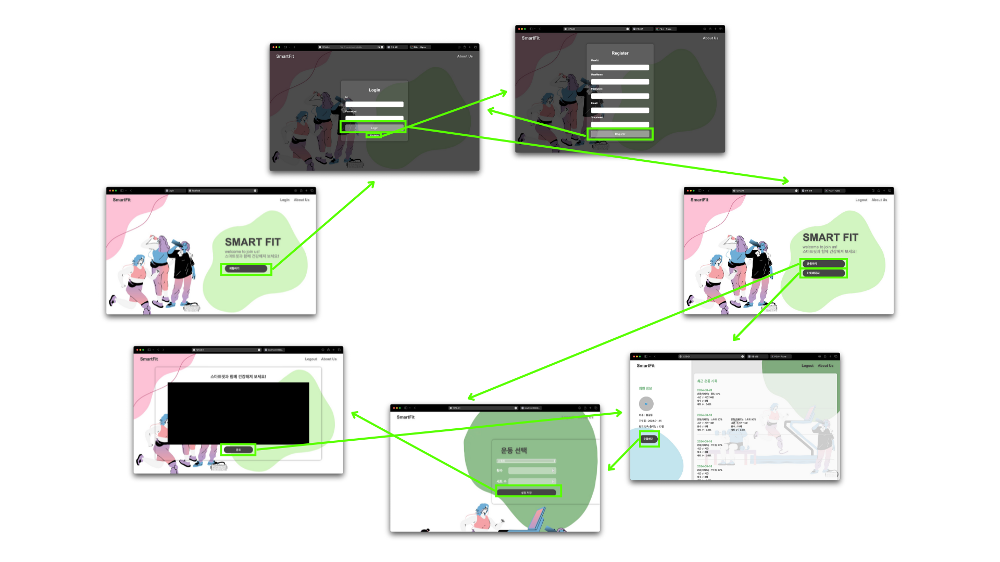
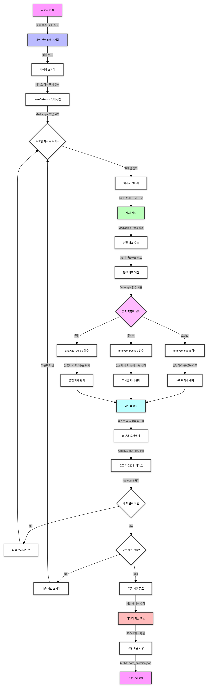

# SmartFit

SmartFit은 운동 활동을 실시간으로 기록·분석해 운동 동기를 장려합니다.

<br/>

---

<br/>

# Stacks & Tools

|                             | NAME                                       |
| --------------------------- | ------------------------------------------ |
| Language                    | `Java` `Python` `HTML` `CSS` `Java Script` |
| Framework                   | `Spring Boot` `Thymeleaf` `Flask`          |
| IDE                         | `VScode` `IntelliJ`                        |
| Source Code Management      | `Git` `Github`                             |
| Test                        | `live server`                              |
| Project Document Management | `Notion` `Figma` `canva` `erdcloud`        |
| Collaboration Tools         | `Zoom` `Kakao chat`                        |

<br/>

---

<br/>

# 프로젝트 설명

## 프로젝트 배경 및 동기

건강을 유지하고자 헬스장을 방문하지만, 헬스장 이용비용이 매우 비싸며 시간과 노력이 많이 듭니다. 특히 바쁜 일상을 보내는 사람들에게는 헬스장에 정기적으로 방문하는 것이 쉽지 않은 일이기도 합니다. 또한, 집에서 운동 하더라도 올바른 자세를 유지하지 못해 부상을 당하거나 운동 효과를 제대로 보지 못하는 경우가 많습니다. 이런한 문제점을 해결하고자 AI 개인 트레이너 프로젝트를 개발하게 되었습니다.

<br/>

## 프로젝트 목적

- AI 개인 트레이너 프로젝트는 집에서도 헬스장 수준의 운동 지도를 받을 수 있도록 하는 것을 목표로 합니다.

- 이 서비스는 누구나 쉽게 접근할 수 있으며, 운동에 대한 흥미를 지속적으로 유지할 수 있도록 도와줍니다.

- 이를 통해 사회 전반적으로 건강한 생활을 누구나 자유롭게 누리도록 지원하는 것이 이 프로젝트의 궁극적인 목표입니다.

<br/>

## 기대효과

사용자들의 건강을 증진시키고, 경제적 부담을 줄이며, 집에서도 헬스장 수준의 운동을 가능하게 한다. 이로인해 개인의 삶의 질을 높이는데 기여하고, 운동을 생활화 할 수 있다. 또한, 디지털 헬스케어 분야의 발전을 촉진하며, AI기술의 새로운 활용 가능성을 제시한다.

<br/>

## SmartFit의 현재 기능

사용자가 달성하고자 하는 운동 목표를 설정하고 사전 학습된 모델을 통해 사용자 자세의 미세한 오류를 자동으로 인식하고, AI를 통해 즉각적으로 올바른 자세를 제안합니다. 사용자들의 운동 동기를 지속적으로 고취시키고 성과를 극대화할 수 있도록 지원합니다.

<br/>

## 프로젝트 문제점 및 해결 방안

본 프로젝트에서는 프론트엔드, 백엔드, 모델 개발 간의 협업 과정에서 다음과 같은 문제점이 발생하였고, 이를 다음과 같이 해결하였습니다.

- 성능 최적화 이슈

: 실시간 분석을 위한 시스템 자원이 과다하게 소모되어 성능 저하가 발생하는 문제가 있었고, 성능 최적화를 위해 코드 최적화 및 리소스 관리를 강화하여 해결했습니다.

- 데이터 보안 및 개인정보 보호

: 사용자 운동 데이터를 처리하는 과정에서 데이터 보안과 개인정보 보호 문제가 있었고, 데이터를 암호화하고 접근 권한을 제한하여 보안 수준을 강화했습니다.

- 동기 부여 및 팀워크 문제

: 각 팀이 서로 다른 목표를 가지고 있어 협업이 원활하지 않았고, 모든 팀이 공통의 목표를 공유하고 주기적으로 성과를 리뷰하는 방식을 도입하여 팀워크를 개선했습니다.

<br/>

## 추후 추가하고 싶은 기능

- 개인화된 운동 프로그램 추천

: 사용자의 운동 기록과 목표를 기반으로 개인 맞춤형 운동 프로그램을 자동으로 생성하고 추천할 예정입니다.

- 소셜 피드 및 경쟁 기능

: 사용자가 친구나 다른 사용자들과 운동 기록을 공유하고, 서로 경쟁할 수 있는 소셜 피드와 리더보드를 도입할 예정입니다.

- 음성 피드백 기능

: 운동 중에 실시간으로 음성 피드백을 제공하여 사용자가 바로 자세를 수정할 수 있도록 지원하는 기능을 도입할 예정입니다.

- 운동 성과 분석 보고서

: 주간 또는 월간 단위로 사용자의 운동 성과를 분석하여 그래프나 차트 형태의 보고서를 제공하는 기능을 추가할 계획입니다.

- 다양한 운동 종목 지원

: 현재 제공하는 운동 외에도 요가, 필라테스, 고강도 인터벌 트레이닝(HIIT) 등 다양한 운동 종목을 지원할 계획입니다.

<br/>

---

<br/>

# 프로젝트 설치 방법

## Flask 어플리케이션 실행

1. Flask 설치유무를 확인하고 설치가 되지 않았다면 pip를 활용하여 설치합니다.

```
pip install flask
```

2. Flask 어플리케이션을 실행합니다.

```
python app.py
```

## Gradle Wrapper 스크립트 실행

1. Linux나 Mac을 사용하는 경우, ./gradlew에 실행 권한이 없을 수 있습니다.

해결 방법 : 다음 명령어를 통해 실행 권한을 부여할 수 있습니다.

```
chmod +x ./gradlew
```

2. Gradle Wrapper 스크립트를 실행합니다.

```
./gradlew boot run
```

## 로컬 브라우저 방문

Flask와 Gradle Wrapper 스크립트를 정상적으로 실행했다면, 브라우저를 열고 'localhost:8080'을 방문하여 프로덕트를 확인 할 수 있습니다.

<br/>

---

<br/>

# 워크플로우

- System Architecture
  
- Task Flow
  
- Screen Flow
  
- Model Architecture
  

<br/>

---

<br/>

# Branch Rule

- master : 제품으로 출시될 수 있는 브랜치
- develop : 다음 출시 버전을 개발하는 브랜치
- feature : 기능을 개발하는 브랜치
- release : 이번 출시 버전을 준비하는 브랜치
- hotfix : 출시 버전에서 발생한 버그를 수정하는 브랜치

# Commit Message Rule

- feat (기능 구현)
- fix (버그 수정)
- docs (문서 작업 / README.md 등)
- style (코드 스타일, 세미콜론 누락 등 / 코드의 로직에 영향을 주지 않아야 한다.)
- refactor (코드 리팩토링)
- test (테스트 코드)
- chore (프로그램 실행과 관련 없는 작업, 빌드 시스템, 패키지 매니저 설정 등)
  <br/>

---

<br/>

# Developers

<div align='center'>
<table>
    <thead>
        <tr>
            <th colspan="5">SmartFit</th>
        </tr>
    </thead>
    <tbody>
        <tr>
          <tr>
            <td align='center'><a href="https://github.com/iksang0110"></td>
            <td align='center'><a href="https://github.com/Takeetnez"></td>
            <td align='center'><a href="https://github.com/Suuuuuuuuuumin"></td>
          </tr>
          <tr>
            <td align='center'>정익상</td>
            <td align='center'>최이지</td>
            <td align='center'>오수민</td>
          </tr>
          <tr>
            <td>담당 : 모델 구축<br/>이메일 : wjddlrtkd0110@naver.com<br/>깃허브 : dlrtkd0110</td>
            <td>최이지</td>
            <td>담당 : Frontend<br/>이메일 : osm374@gmail.com <br/>깃허브 : Suuuuuuuuuumin</td>
          </tr>
        </tr>
    </tbody>
</table>
</div>
